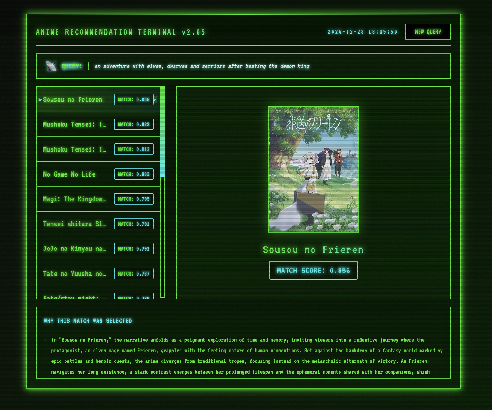

# Animood




A high-quality anime recommendation engine built with Rust, powered by semantic search and LLM-enriched data. Finds anime based on thematic similarity, story elements, and user preferences.

## Overview

This system provides intelligent anime recommendations by:

- Semantic Understanding: Uses Jina Embeddings (small) v2 to capture thematic and narrative similarity
- LLM-Enhanced Data: Each anime entry includes GPT-4o-mini generated insights about pacing, themes, and characteristics
- Context-Aware Retrieval: Synopses are augmented with web search results for richer context
- Hybrid Ranking: Combines semantic similarity with normalized popularity metrics (MAL scores, members, favorites)


Quality Filtering: The dataset contains 6.5k curated anime, filtered to exclude hentai and include only titles with:

- MAL score > 5.0
- At least 4,000 user ratings
- Minimum 10,000 members

I've burnt $2 on openai so if you find useful you can use the data generated by `gpt-4o-mini`, its in `anime-llm-analysis`.

Data was collected in late december 2025.

## Quick Start
###  Prerequisites

- Rust 1.70+
- `embeddings.bin` file (pre-generated with the dataset)

## Running the Server


```bash
cargo build --release
```

```bash
# Start the API server
cargo run --release
# Server starts at: http://localhost:3005
```

## API Usage

### Get Recommendations

```bash
curl -X POST http://localhost:3005/query \
  -H "Content-Type: application/json" \
  -d '{
    "query": "psychological thriller with complex characters",
    "k": 15
  }'
```

### Response Example:

```json
[
  {
    "title": "Steins;Gate",
    "score": 0.942,
    "image_url": "https://cdn.myanimelist.net/images/anime/5/73199.jpg",
    "llm_description": "A sci-fi thriller about time travel... Complex characters... Slow-burn pacing..."
  }
  ...
]
```