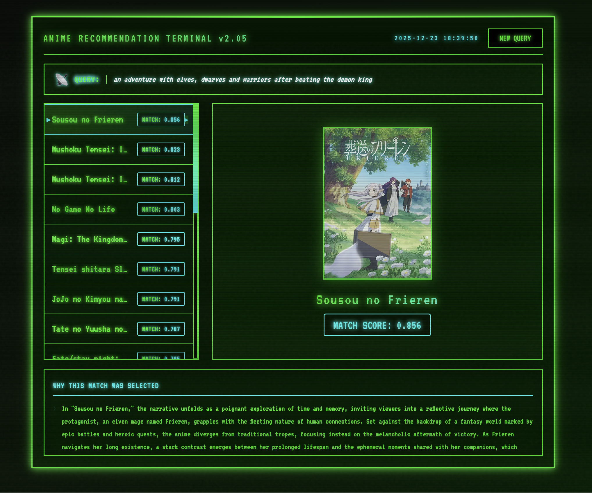

# Animood




A high-quality anime recommendation engine built with Rust, powered by semantic search and LLM-enriched data. Finds anime based on thematic similarity, story elements, and user preferences given his **Myanimelist username**.

## Overview

This system provides intelligent anime recommendations by:

- Semantic Understanding: Uses Jina Embeddings (small) v2 to capture thematic and narrative similarity
- LLM-Enhanced Data: Each anime entry includes GPT-4o-mini generated insights about pacing, themes, and characteristics
- Context-Aware Retrieval: Synopses are augmented with web search results for richer context
- Hybrid Ranking: Combines semantic similarity with normalized popularity metrics (MAL scores, members, favorites)
- Takes the user data from MAL into account and recommend global, and per favorite genre's anime.


Quality Filtering: The dataset contains 6.5k curated anime, filtered to exclude hentai and include only titles with:

- MAL score > 5.0
- At least 4,000 user ratings
- Minimum 10,000 members

I've burnt $2 on openai so if you find useful you can use the data generated by `gpt-4o-mini`, its in `anime-llm-analysis`.

Data was collected in late december 2025.

## Quick Start
###  Prerequisites

- Rust 1.70+
- `embeddings.bin` file (pre-generated with the dataset)

## Running the Server


```bash
cargo build --release
```

```bash
# Start the API server
cargo run --release
# Server starts at: http://localhost:3000
```

## API Usage

### Get Recommendations

```bash
curl -X POST http://localhost:3000/query \
  -H "Content-Type: application/json" \
  -d '{
    "query": "Global",
    "k": 20,
    "username": "Dornelles"
  }' | jq .
```

```bash
curl -X POST http://localhost:3000/query \
  -H "Content-Type: application/json" \
  -d '{
    "query": "Beautiful visuals, elves, growth, friendship but not super boring...",
    "k": 20,
  }'
```

### Response Example:

```json
{
  "global_recommendations": [
    {
      "title": "Example Anime Title",
      "score": 0.16216275,
      "image_url": "https://cdn.myanimelist.net/images/anime/5/19570l.webp",
      "llm_description": "AI-generated description of the anime...",
      "mal_id": 2025
    }
  ],
  "genre_recommendations": [
    {
      "genre_id": 5,
      "genre_name": "Avant Garde",
      "reason": "you're open to Avant Garde storytelling that's experimental and unconventional",
      "recommendations": [
        {
          "title": "Example Genre Anime",
          "score": 0.8581099,
          "image_url": "https://cdn.myanimelist.net/images/anime/1404/98182l.webp",
          "llm_description": "AI-generated description...",
          "mal_id": 32
        }
      ]
    }
  ],
  "global_genres": [
    {
      "id": 1,
      "name": "Action",
      "count": 70
    }
  ],
  "favorite_genres": [
    {
      "id": 8,
      "name": "Drama",
      "count": 21
    }
  ],
  "favorites": [
    {
      "anime_id": 31043,
      "title": "Example Favorite Anime",
      "score_diff": 1.7,
      "image_url": "https://cdn.myanimelist.net/r/192x272/images/anime/10/77957.jpg"
    }
  ],
  "unpreferred": [
    {
      "anime_id": 19163,
      "title": "Example Disliked Anime",
      "score_diff": -1.17,
      "image_url": "https://cdn.myanimelist.net/r/192x272/images/anime/1690/141818.jpg"
    }
  ]
}
]
```